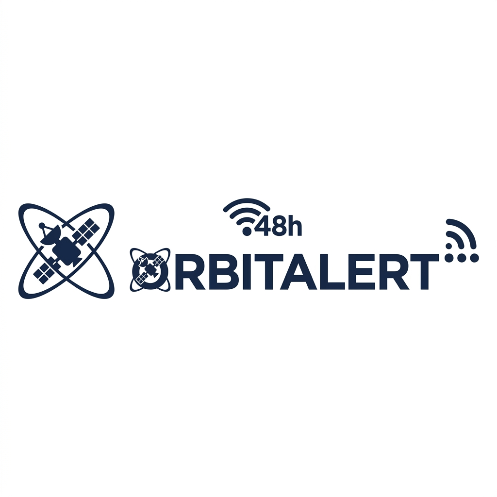

<div align="center">



# 🛰️ OrbitAlert — Mobile

### Plataforma de Monitoramento de Desastres Naturais via Satélite

[](https://expo.dev)
[](https://reactnative.dev)
[](https://typescriptlang.org)
[](https://fiap.com.br)
[](LICENSE)

**Global Solution 2026 · Turma 2TDSPF**

</div>

---

## 🎬 Vídeo de Demonstração

> ▶️ **[Assistir no YouTube](https://www.youtube.com/watch?v=LINK_DO_VIDEO_AQUI)**
>
> *(Substitua o link acima pelo link real do vídeo no YouTube após a gravação)*

---

---

## 💡 Descrição da Solução — Global Solution 2026

**Tema:** Monitoramento e Prevenção de Desastres Naturais via Tecnologia Espacial

O **OrbitAlert** é uma solução mobile que utiliza dados do satélite **Sentinel-1** da ESA (Agência Espacial Europeia) para monitorar, alertar e orientar equipes de Defesa Civil municipal diante de desastres naturais como enchentes, deslizamentos e secas.

**Problema abordado:** O Brasil sofre anualmente com desastres naturais que causam mortes e prejuízos econômicos. A falta de sistemas de alerta precoce acessíveis a gestores públicos municipais — que são os primeiros a responder às emergências — é um dos principais gargalos na gestão de crises.

**Como resolvemos:** Desenvolvemos um aplicativo que:
- Integra dados de satélite de radar SAR (Sentinel-1) com atualização a cada 6–12 dias
- Exibe alertas georeferenciados com nível de risco (1 a 5) e ações recomendadas
- Monitora uma rede de sensores IoT (pluviômetros, nível de rios, inclinômetros)
- Permite criar, editar, consultar e excluir alertas diretamente pelo celular via API REST
- Funciona offline com cache local, garantindo operação mesmo sem internet
- Envia vibração automática ao detectar novos alertas críticos em tempo real

**Impacto esperado:** Redução do tempo de resposta a emergências por gestores municipais, aumentando a capacidade de evacuação preventiva e salvando vidas.

---

## 📋 Índice

- [Sobre o Projeto](#-sobre-o-projeto)
- [Problema & Solução](#-problema--solução)
- [Funcionalidades](#-funcionalidades)
- [Arquitetura](#-arquitetura)
- [Tecnologias](#-tecnologias)
- [Estrutura do Projeto](#-estrutura-do-projeto)
- [Como Executar](#-como-executar)
- [API Backend](#-api-backend)
- [Telas do Aplicativo](#-telas-do-aplicativo)
- [Equipe de Desenvolvimento](#-equipe-de-desenvolvimento)

---

## 🌍 Sobre o Projeto

O **OrbitAlert** é uma aplicação móvel desenvolvida para a **Global Solution 2026** da FIAP, com o objetivo de auxiliar gestores da Defesa Civil e equipes de emergência no monitoramento em tempo real de desastres naturais.

A plataforma integra dados do satélite **Sentinel-1** da **ESA (Agência Espacial Europeia)**, processados via **Copernicus Emergency Management Service (CEMS)**, fornecendo alertas georeferenciados com até 48 horas de antecedência sobre eventos como enchentes, deslizamentos e secas.

> **Contexto:** Desastres naturais causam perdas humanas e econômicas imensas no Brasil. A falta de sistemas de alerta precoce acessíveis e integrados para gestores públicos municipais é um dos principais obstáculos à resposta eficaz. O OrbitAlert resolve isso colocando dados de satélite na palma da mão dos responsáveis pela segurança pública.

---

## 🎯 Problema & Solução

| Problema | Solução OrbitAlert |
|---|---|
| Dados de satélite inacessíveis para gestores municipais | App mobile simples e intuitivo com dados em tempo real |
| Alertas tardios de desastres | Polling automático a cada 30s + notificação com vibração |
| Falta de informação georeferenciada | Alertas com coordenadas GPS e abertura direta no mapa |
| Monitoramento desconectado de sensores IoT | Integração com rede de sensores pluviométricos e de nível |
| Decisões sem protocolo claro | Ações recomendadas por nível de risco (1 a 5) |

---

## ✨ Funcionalidades

### 🔐 Autenticação
- Login com **JWT** via API Spring Boot
- Fallback local com **AsyncStorage** quando offline
- Cadastro de novos usuários com persistência local
- Logout seguro com limpeza de token

### 📊 Dashboard — Home
- Indicador de status ao vivo (**Online / Offline — cache**)
- Timestamp de última atualização
- **Cards de resumo**: Críticos | Sensores Online | Total de alertas
- Distribuição de alertas por nível de risco (1–5)
- Lista dos alertas mais recentes
- Resumo da rede de sensores IoT
- Pull-to-refresh com atualização manual

### 🚨 Aba de Alertas
- **Busca full-text** por título, município, estado e descrição
- **Filtros por tipo** de desastre: Enchente, Deslizamento, Seca, Outros
- **Filtros por nível** de risco: N1 a N5 com cor representativa
- **Toggle "Só Ativos"** para alertas em andamento
- **Ordenação**: Mais recente / Maior risco / Menor risco
- **Barra de estatísticas ao vivo**: Críticos | Ativos | Hoje | Filtrados
- Estado vazio inteligente com botão para limpar filtros

### 📄 Detalhe do Alerta
- Banner colorido com nível de risco
- Tipo de desastre com ícone e descrição técnica
- **Ações recomendadas** por nível (ex: Nível 5 = Evacuação imediata)
- Coordenadas GPS do evento
- **Abrir no mapa** (Google Maps / Apple Maps)
- **Compartilhamento nativo** com mensagem formatada
- Link direto para o **Portal CEMADEN**

### 📡 Sensores IoT
- Busca de sensores via API com **fallback de demonstração**
- Sensores agrupados: Online → Manutenção → Offline
- Ícones por tipo: Pluviômetro, Nível de Rio, Meteorológica, Inclinômetro, Barômetro
- Leitura atual com valor e unidade de medida
- Indicador de bateria com cor por criticidade
- Pull-to-refresh sincronizado com o contexto global

### 👤 Perfil & Configurações

#### 🔔 Notificações e Alertas
- Toggle global de alertas
- Filtros individuais por nível de risco (N1–N5) com cores
- Controles de **vibração** e **som**
- Opção de **resumo diário**
- **Botão de simulação** de alerta com padrão vibratório de emergência
- Configurações salvas no AsyncStorage

#### 🔐 Segurança e Senha
- **Alterar e-mail**: valida formato, confirma com senha atual, verifica duplicidade
- **Alterar senha**: valida senha atual, mínimo 6 caracteres, confirmação
- Tudo salvo em `@orbit_users` / `@orbit_user` / `@orbit_token`
- Layout accordion (expansível/recolhível)

#### ❓ Central de Ajuda
- **FAQ expansível** com 6 perguntas frequentes sobre o sistema
- Contatos clicáveis (e-mail, telefone, portal web)
- Informações sobre a versão e fonte de dados

#### 👨‍💻 Desenvolvedores
- Perfil de cada membro da equipe com foto
- RM, papel e links para GitHub e LinkedIn

---

## 🏗️ Arquitetura

```
┌─────────────────────────────────────────────────────────────┐
│                     OrbitAlert Mobile                        │
│                    (React Native / Expo)                     │
└──────────────────────────┬──────────────────────────────────┘
                           │
           ┌───────────────┼───────────────┐
           │               │               │
    ┌──────▼──────┐ ┌──────▼──────┐ ┌──────▼──────┐
    │  AuthContext │ │AlertContext │ │AsyncStorage │
    │  (JWT/local) │ │(polling 30s)│ │  (cache)    │
    └──────┬──────┘ └──────┬──────┘ └─────────────┘
           │               │
           └───────┬───────┘
                   │
          ┌────────▼────────┐
          │   Axios + JWT    │
          │  Interceptors    │
          └────────┬────────┘
                   │
          ┌────────▼────────────────────┐
          │  Spring Boot API            │
          │  java-advanced-2-7tix       │
          │  (Render — free tier)       │
          └─────────────────────────────┘
```

### Fluxo de Autenticação
```
Login → Tenta API → Sucesso: salva JWT → Dashboard
                  → Falha (offline/timeout): verifica AsyncStorage local
                                           → Encontrou: autentica localmente
                                           → Não encontrou: exibe erro
```

### Fluxo de Alertas em Tempo Real
```
App abre → loadCache (exibição imediata) → startPolling (a cada 30s)
         → fetchAll() → alertas + sensores em paralelo
         → novos alertas detectados → vibração se configurada
         → atualiza estado → Fast Refresh na UI
```

---

## 🛠️ Tecnologias

### Core
| Tecnologia | Versão | Uso |
|---|---|---|
| [React Native](https://reactnative.dev) | 0.85.3 | Framework mobile |
| [Expo](https://expo.dev) | SDK 56 | Plataforma e build |
| [TypeScript](https://typescriptlang.org) | 6.0 | Tipagem estática |

### Navegação
| Biblioteca | Versão | Uso |
|---|---|---|
| `@react-navigation/native` | 7.2.6 | Core de navegação |
| `@react-navigation/native-stack` | 7.17.0 | Stacks de telas |
| `@react-navigation/bottom-tabs` | 7.17.0 | Barra de abas |

### UI & Design
| Biblioteca | Versão | Uso |
|---|---|---|
| `@expo/vector-icons` | 15.0.2 | Ícones Feather + MCI |
| `@expo-google-fonts/inter` | 0.4.2 | Fonte Inter |
| `expo-linear-gradient` | 56.0.4 | Gradientes |
| `react-native-safe-area-context` | 5.7.0 | Safe areas |
| `react-native-screens` | 4.25.2 | Otimização de telas |

### Dados & Storage
| Biblioteca | Versão | Uso |
|---|---|---|
| `axios` | 1.17.0 | Requisições HTTP |
| `@react-native-async-storage/async-storage` | 2.2.0 | Persistência local |
| `expo-secure-store` | 56.0.4 | Armazenamento seguro |

### Notificações & Sensores
| Biblioteca | Versão | Uso |
|---|---|---|
| `expo-notifications` | 56.0.16 | Push notifications |
| `react-native` `Vibration` | built-in | Vibração de alertas |

---

## 📁 Estrutura do Projeto

```
MOBILE-APPLICATION-DEVELOPMENT/
│
├── App.tsx                          # Entry point, providers globais
├── index.ts                         # Bootstrap Expo
├── app.json                         # Configuração Expo (bundle ID, ícones, permissões)
├── package.json                     # Dependências do projeto
├── tsconfig.json                    # Configuração TypeScript
├── babel.config.js                  # Configuração Babel
├── .env                             # Variáveis de ambiente (URL da API)
│
├── assets/
│   ├── icon.png                     # Ícone do app
│   ├── splash-icon.png              # Splash screen
│   ├── android-icon-*.png           # Ícones adaptivos Android
│   └── images/
│       ├── logo.png                 # Logo OrbitAlert
│       ├── dev1.jpg                 # Foto desenvolvedor 1
│       ├── dev2.jpg                 # Foto desenvolvedor 2
│       ├── dev3.jpg                 # Foto desenvolvedor 3
│       └── dev4.jpg                 # Foto desenvolvedor 4
│
└── src/
    │
    ├── api/
    │   ├── axios.ts                 # Instância Axios + interceptors JWT
    │   └── endpoints.ts             # Centralização de todas as URLs da API
    │
    ├── contexts/
    │   ├── AuthContext.tsx          # Gerenciamento de autenticação global
    │   └── AlertContext.tsx         # Alertas em tempo real + sensores (polling 30s)
    │
    ├── navigation/
    │   ├── AppNavigator.tsx         # Roteador raiz (Auth vs Main)
    │   ├── AuthNavigator.tsx        # Stack de autenticação (Login/Cadastro)
    │   └── MainNavigator.tsx        # Tabs + Stacks do app autenticado
    │
    ├── screens/
    │   ├── SplashScreen.tsx         # Tela de carregamento inicial
    │   ├── LoginScreen.tsx          # Login com email e senha
    │   ├── RegisterScreen.tsx       # Cadastro de novo usuário
    │   ├── DashboardScreen.tsx      # Home com resumo ao vivo
    │   ├── AlertsScreen.tsx         # Lista de alertas com filtros completos
    │   ├── AlertDetailScreen.tsx    # Detalhe completo do alerta
    │   ├── SensorsScreen.tsx        # Rede de sensores IoT
    │   ├── ProfileScreen.tsx        # Perfil e menu de configurações
    │   └── settings/
    │       ├── NotificationsScreen.tsx  # Config de notificações por nível
    │       ├── SecurityScreen.tsx       # Alterar e-mail e senha
    │       ├── HelpScreen.tsx           # FAQ + contatos + sobre
    │       └── DevelopersScreen.tsx     # Equipe de desenvolvimento
    │
    ├── components/
    │   ├── AlertCard.tsx            # Card reutilizável de alerta
    │   ├── RiskBadge.tsx            # Badge colorido por nível de risco
    │   └── LoadingOverlay.tsx       # Overlay de carregamento
    │
    ├── services/
    │   ├── authService.ts           # Operações de autenticação (login/register)
    │   ├── alertService.ts          # CRUD de alertas via API
    │   └── sensorService.ts         # Busca de sensores + cache + mock
    │
    ├── types/
    │   ├── Alert.ts                 # Interface Alert + RiskLevel + AlertFilters
    │   └── User.ts                  # Interface User + LoginRequest/Response
    │
    └── utils/
        ├── theme.ts                 # Design system (cores, fontes, radii)
        ├── riskColors.ts            # Paleta de cores por nível de risco
        └── dateFormatter.ts         # Formatação de datas (timeAgo, formatFullDate)
```

---

## 🚀 Como Executar

### Pré-requisitos

- [Node.js](https://nodejs.org) >= 18
- [Git](https://git-scm.com)
- [Expo Go](https://expo.dev/go) instalado no celular **ou** Android Emulator configurado
- Android Studio (para emulador)

### Instalação

```bash
# 1. Clone o repositório
git clone https://github.com/GS-2TDSPF/MOBILE-APPLICATION-DEVELOPMENT.git
cd MOBILE-APPLICATION-DEVELOPMENT

# 2. Instale as dependências
npm install

# 3. Configure as variáveis de ambiente
# Crie um arquivo .env na raiz com:
echo "EXPO_PUBLIC_API_BASE_URL=https://java-advanced-2-7tix.onrender.com" > .env

# 4. Inicie o servidor Metro
npx expo start --clear --port 8081
```

### Executar no Emulador Android

```bash
# Com Android Studio aberto e emulador rodando:
npx expo start --android --port 8081
```

### Executar no Expo Go (celular físico)

```bash
npx expo start

# Escaneie o QR Code com o app Expo Go
```

> ⚠️ **Nota sobre o Backend:** O servidor está hospedado no **Render (free tier)** e pode demorar até 60 segundos para "acordar" na primeira requisição após inatividade. O app possui cache local e funciona offline após a primeira carga.

---

## 🔌 API Backend

### Base URL
```
https://java-advanced-2-7tix.onrender.com
```

### Autenticação
Todas as rotas (exceto login e cadastro) requerem **Bearer Token JWT** no header:
```
Authorization: Bearer <token>
```

### Endpoints

#### Auth
| Método | Rota | Descrição |
|--------|------|-----------|
| `POST` | `/auth/login` | Login com email e senha |
| `POST` | `/auth/register` | Cadastro de novo usuário |

#### Alertas
| Método | Rota | Descrição |
|--------|------|-----------|
| `GET` | `/alertas` | Lista todos os alertas (com filtros opcionais) |
| `GET` | `/alertas/ativos` | Lista apenas alertas ativos |
| `GET` | `/alertas/{id}` | Retorna um alerta específico |
| `POST` | `/alertas` | Cria novo alerta |
| `PUT` | `/alertas/{id}` | Atualiza alerta |
| `DELETE` | `/alertas/{id}` | Remove alerta |

**Filtros disponíveis** (query params):
```
GET /alertas?nivel=4&ativo=true&municipio=São Paulo
```

#### Usuários
| Método | Rota | Descrição |
|--------|------|-----------|
| `GET` | `/usuarios` | Lista usuários |
| `GET` | `/usuarios/{id}` | Usuário por ID |
| `GET` | `/usuarios/perfil` | Perfil do usuário autenticado |

### Modelos de Dados

#### Alert
```typescript
interface Alert {
  id: number;
  titulo: string;
  descricao: string;
  nivel: 1 | 2 | 3 | 4 | 5;        // 1=Baixo ... 5=Crítico
  municipio: string;
  estado: string;
  latitude: number;
  longitude: number;
  dataHora: string;                  // ISO 8601
  ativo: boolean;
  tipoDesastre: 'DESLIZAMENTO' | 'ENCHENTE' | 'SECA' | 'OUTROS';
}
```

#### User
```typescript
interface User {
  id: number;
  nome: string;
  email: string;
  municipio?: string;
  cargo?: string;
  role?: string;
}
```

### Níveis de Risco

| Nível | Label | Cor | Ação Recomendada |
|-------|-------|-----|-----------------|
| 1 | Baixo | 🟢 Verde | Monitoramento preventivo |
| 2 | Atenção | 🟡 Limão | Alertar equipes de campo |
| 3 | Moderado | 🟠 Âmbar | Acionar Defesa Civil municipal |
| 4 | Alto | 🔴 Vermelho | Evacuar áreas de risco |
| 5 | Crítico | 🟣 Roxo | EMERGÊNCIA ATIVA — Evacuação imediata |

---

## 📱 Telas do Aplicativo

| Tela | Descrição |
|------|-----------|
| **Splash** | Animação de carregamento com logo |
| **Login** | Autenticação com fallback offline |
| **Cadastro** | Registro de novo usuário |
| **Dashboard** | Home com alertas e sensores ao vivo |
| **Alertas** | Lista completa com filtros avançados |
| **Detalhe do Alerta** | Informações completas + mapa + compartilhar |
| **Sensores IoT** | Rede de monitoramento terrestre |
| **Perfil** | Dados do usuário + menu de configurações |
| **Notificações** | Configurar alertas por nível de risco |
| **Segurança** | Alterar e-mail e senha |
| **Central de Ajuda** | FAQ + contatos |
| **Desenvolvedores** | Equipe do projeto |

---

## 👨‍💻 Equipe de Desenvolvimento

> **Turma:** 2TDSPF · **Instituição:** FIAP · **Ano:** 2026

| | Nome | RM | Papel | GitHub | LinkedIn |
|--|------|----|-------|--------|----------|
|  | **Moisés Waidemann** | RM: 563719 | Backend Developer | [GitHub](https://github.com/https://github.com/Waidemannm) | [LinkedIn](https://www.linkedin.com/in/moises-waidemann/) |
|  | **Richard Freitas** | RM: 566127 | Mobile Developer | [GitHub](https://github.com/rickk1stdev) | [LinkedIn](https://www.linkedin.com/in/richard-freitas/) |
|  | **Gabriel Sbrana** | RM: 565849 | Full Stack Developer | [GitHub](https://github.com/devsbrana) | [LinkedIn](https://www.linkedin.com/in/gabriel-sbrana-campos/) |
|  | **Thiago Mota** | RM: 563650 | Full Stack Developer | [GitHub](https://github.com/ThiagoMoota) | [LinkedIn](https://www.linkedin.com/in/thiagomoota/) |

> ✏️ **Para editar:** atualize os nomes, RMs e links diretamente neste arquivo e também em [`src/screens/settings/DevelopersScreen.tsx`](src/screens/settings/DevelopersScreen.tsx)

---

## 📡 Fonte de Dados

O OrbitAlert utiliza dados do programa **Copernicus** da **ESA (Agência Espacial Europeia)**:

- **Satélite:** Sentinel-1 (Radar SAR — Synthetic Aperture Radar)
- **Resolução:** 10–20 metros
- **Cobertura:** A cada 6–12 dias por região
- **Capacidade:** Detecção de enchentes, deslizamentos e movimentos de terra
- **Serviço de emergência:** CEMS — Copernicus Emergency Management Service

---

## 📄 Licença

Este projeto está sob a licença **MIT**. Veja o arquivo [LICENSE](LICENSE) para mais detalhes.

---

<div align="center">

Desenvolvido com 💙 pela equipe **OrbitAlert** — FIAP Global Solution 2026

*"Usando tecnologia espacial para salvar vidas no solo"*

</div>
